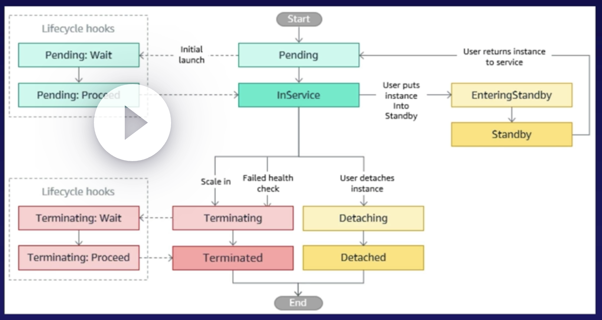

# High Availability and Scaling
## Horizontal vs Vertical Scaling

### Vertical Scaling
Vertical scaling is adding more resources to a single instance

### Horizontal Scaling
Increase number of instances rather than increasing the size of one instance.  This also accomplishes high availability.

### The 3 W's of Scaling
- **What do we scale?**
	  We have to decide what sort of resource we're going to scale.  How do we define the template?
- **Where do we scale?**
	  When applying the model, where does it go?  Should we scale out database?  Or Webservers?
- **When do we scale?**
	  How do we know we need more?  CloudWatch alarms can tell us when it's time to add more resources.

---
## Launch Templates and Launch Configurations

### What is a Launch Template?

A launch template specifies all the needed settings that go into building an EC2 instance.  It is a collections of settings you can configure so you don't have to walk through the EC2 wizard over and over.

### Launch Templates vs Launch Configurations

Launch configurations are the predecessor to Launch Templates

| Templates | Configurations |
| ---- | ---- |
| Capable of leverageing all EC2 Auto Scaling features | Only for certain EC2 Autoscaling feature |
| Supports versioning | Immutable |
| More granularity | Limited configuration options |
| AWS recommends this approach | Try not to use them |

### What makes a Template?
You need to know it includes the AMI, EC2 instance size, security groups, and potentially networking information

---
## Scaling EC2 Instances with Auto Scaling

### Auto Scaling Groups

An Auto Scaling group contains a collection of **EC2** instances that are treated as a collective group for purpoeses of **scaling** and **management.**
### Auto Scaling Steps

- **Define Your Template**
	  You pick from your available launch templates or configurations.
- **Networking and Purchasing**
	  Pick your networking space and purchasing options.  Using multiple AZs allows for high availability (HA).
- **ELB Configuration**
	  EC2 instances can be registered behind a load balancer.  The Auto Scaling group can be set to respect the load balancer health checks.
- **Set Scaling Policies**
	  Minimum, Maximum, and desired capacity needs to be set to ensure you don't have too many or too few resources.
- **Notifications**
	  SNS can act as a notification tool, allowing you to  let someone know when a scaling event occurs.

### Setting Capacity Limits

**Minimum**
This is the lowest number of EC2 instances you'll ever have online.  You won't dip below this.

**Maximum**
The highest number of EC2 instances you'll ever provision.  You won't go above this.

**Desired**
How many instances do you want right now?

### Lifecycle Hooks

- Perform custom actions on instances when corresponding lifecycle events occur.
- Capability to wait up to 2 hours.

### Auto Scaling and High Availability

It's important to remember Auto Scaling is vital to creating a highly available application.

Remember to select answers that spread resources out over multiple Availability Zones and utilize load balancers.

---
## Auto Scaling Policies

##### Step Scaling
Applies stepped adjustments to vary the scaling depending on the size of the alarm breach.

##### Simple Scaling
Relies on metrics for scaling needs.
Ex.  Add 1 instance if CPU Utilization metric > 80%

##### Target Tracking
Uses a scaling metric and a value that your ASG should maintain at all times.
Ex. Maintain ASGAverageCPUUtilization = 50%
### Instance Warm-Up and Cooldown

**Warm-Up**
Stops instances from being placed behind the load balancer, failing the health check, and being terminated prematurely.

**Cooldown**
Pauses Auto Scaling for a set amount of time.  Helps to avoid runaway scaling events.

**Avoid Thrashing**
You want to create instances quickly and spin them down quickly.
### Scaling Types

**Reactive Scaling**
You're playing catch up.  Once the load is there, you measure it, and then determine if you need to create more resources.

**Scheduled Scaling**
If you have a predictable workload, create a scaling event to get your resources ready to go before they're actually needed.

**Predictive Scaling**
AWS uses its machine learning algorithms to determine when you'll need to scale.  They are reevaluated every 24 hours to create a forecast for the next 48.

### It Costs How Much?

You'll need a good understanding of how Auto Scaling handles minimum, maximum, and desired capacity for the exam.

You'll be given scenarios where you'll need to know the cost implications and reasons why you might or might not want to change one of those numbers.

---
## Scaling Relational Databases

### 4 Ways to Scale

**Vertical Scaling**
Resizing the database from one size to another can create greater performance.

**Scaling Storage**
Storage can be resized, but it's only able to go up, not down.

**Read Replicas**
Creating read-only copies of our data can help spread out the workload.

**Aurora Serverless**
We can offload scaling to AWS.  Excels with unpredictable workloads.

### Scaling vs. Refactoring

You'll be given scenarios and, unless otherwise specified, refactoring and changing to DynamoDB is a viable scaling choice.

It won't work that easily in the real world, but in the exam, switching database types can solve the problem.

---
## Scaling Non-Relational Databases

### Scaling Options

**DynamoDB**
Scaling is simplified when using DynamoDB, as AWS does all the heavy lifting for you.

|  | Provisioned | On-Demand |
| ---- | ---- | ---- |
| **Use Case** | Generally predictable workload | Sporadic Workload |
| **Effort to Use** | Need to review past usage to set upper and lower scaling limits | Simply select on-demand |
| **Cost** | Most-cost-effective model | Pay small amount of money per read and write.  Less cost effective. |

### Capacity Units

**Read Capacity Unit (RCU)**
DynamoDB unit of measurement for reads per second for an item up to 4KB in size.
One strongly consistent read per second.
Two eventually consistent reads per second.

Knowledge Check: How many RCUs for 1 strongly consistent read per second for objects that are 7KB in size?

1 RCU = 4KB / 1 Strongly consistent read
Round up to the next nearest amount for the item size = 8KB / 4KB = 2 RCU

**Write Capacity Unit (WCU)**
DynamoDB unit of measurement for writes per second for an item up to 1KB in size.

Knowledge Check:  How many WCUs for  1 write per second for an object that is 3KB in size?

1 RCU = 1KB * 1 Write per second
3 KB  * 1 WCU = 3 WCU

---
## Disaster Recovery Strategies

### Recovery Point Objective (RPO)

In the event of a disaster/failure, at what point in time do you want your data recovered to?  Put simply, how much data can you afford to lose?  Twenty-four hours?  Twelve hours?  Minutes? Seconds?

Typically speaking, the lower the time, the greater the cost.

### Recovery Time Objective (RTO)

In the event of a failure, how fast do you want to fail over?  How much time can the business afford?  The lower the time, the more expensive the cost.

### Backup and Restore

The simplest disaster recovery strategy.  If something happens to your production system, restore that system from backup.
### Pilot Light

A small portion of infra is running on standby in another AZ, and can be scaled into the active by starting the missing services.
### Warm Standby

Where you have a scaled-down version of your production system already running in another Availability Zone/Region.  You then scale this system up in the event of an outage.

### Active/Active Failover

The most expensive disaster recovery strategy.  You have two sites, both active and traffic split between the two.  If one site fails, the other site takes the load.  Generally you have to have both sites at 200% normal capacity to avoid downtime.

