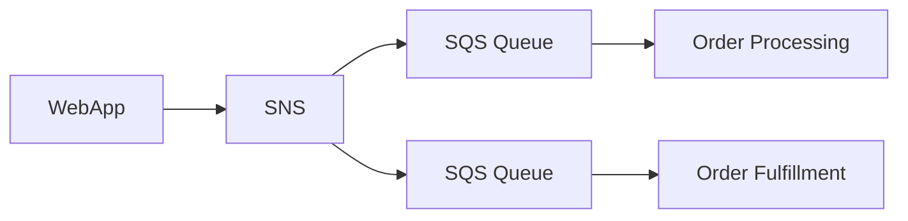
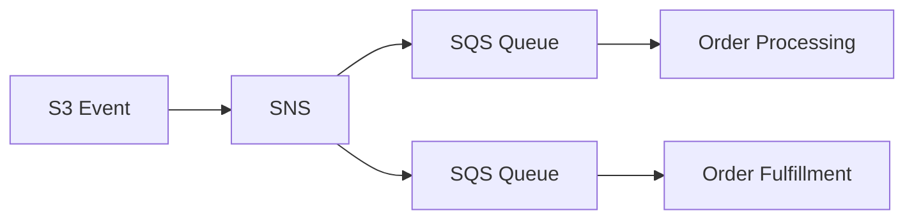
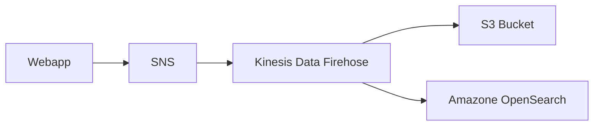
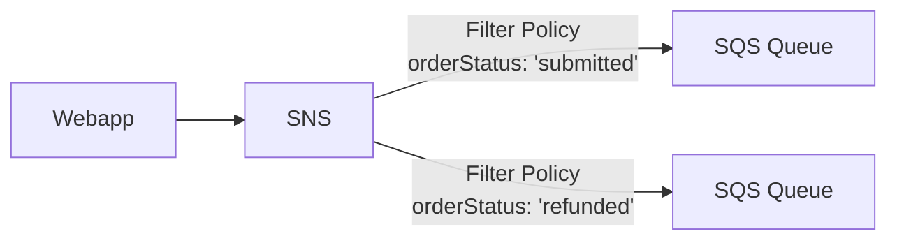
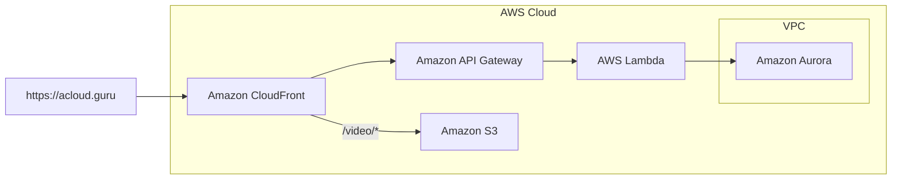
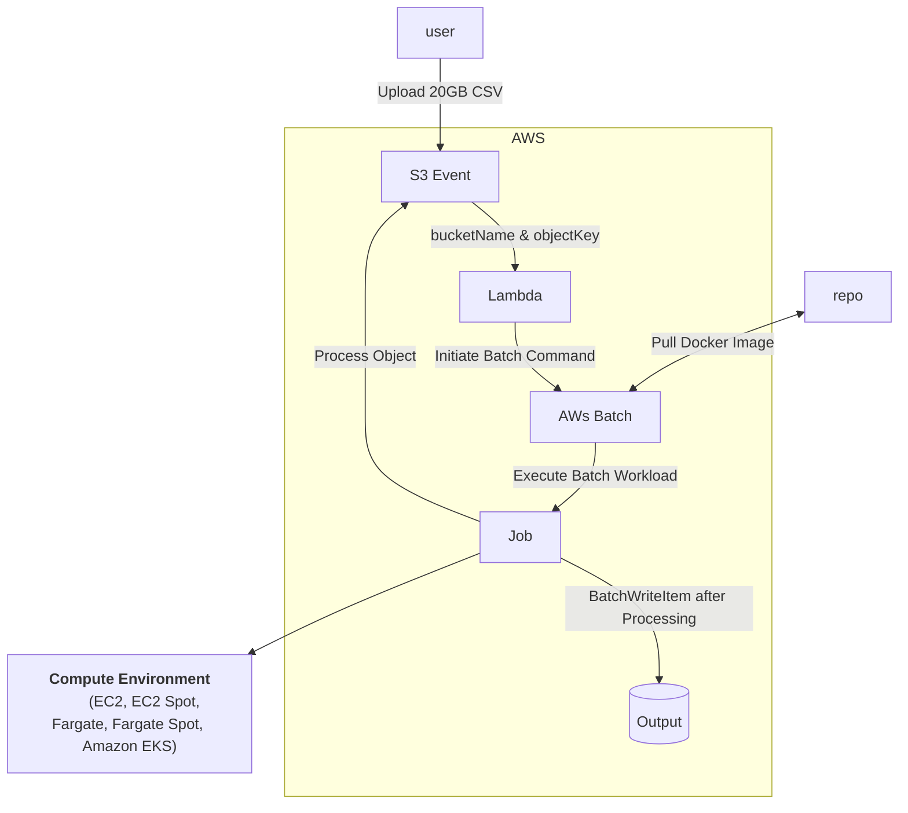

# Decoupling Workflows
## Decoupling Workflows Overview
### Tight Coupling
One instance talks directly to another instance.

### Loose Coupling
Using load balancer or message queues we can distribute traffic across instances so that if instances fail, there is no degradation to the user experience.

### 3 Services to Decouple
**Simple Queue Service (SQS)**
SQS is a fully managed message queueing service that enables you to decouple and scale microservices, distributed systems, and serverless applications.

**Simple Notification Service (SNS)**
SNS is a fully managed messaging service for both application-to-application (A2A) and application-to-person (A2P) communication.

**API Gateway**
API Gateway is a fully managed service that makes it easy for developers to create, publish, maintain, monitor, and secure APIs at any scale.

---
## Messaging with SQS

### Poll-Based Messaging
A producer of messages writes a message into a queue, and the backend consumer polls the queue to retrieve the messages when it is ready.

### What is SQS
Simple Queue Service is a **messaging queue** that allows **asynchronous** processing of work.  One resource will write a message to an SQS queue, and then another resource will retrieve that message from SQS.

### SQS Settings
- **Delivery Delay** - Default is 0; can be set up to 15 minutes.
- **Message Size** - Messages can be up to 256 KB of text in any format.  Can be adjusted down, but not up.
- **Encryption** - Messages are encrypted in transit by default, but you can add at-rest.
- **Message Retention** - Default is 4 days; can be set between 1 minute and 14 days.
- **Long vs. Short**. - Long polling isn't the default, but should be.
- **Queue Depth** - Not a setting, but a value indicating the number of unconsumed messages in the queue.  This can be a trigger for autoscaling.

SQS us seen in many questions on the exam, and it's worth your time to learn all about its settings.

### Visibility Timeout
The amount of time a message is locked after consumption before the consumer acknowledges is has finished consuming the message.   If the timeout is reached, the message is unlocked and made available for consumption again.

---
## Dead-Letter Queues

### Dead-Letter Queues
- Amazon SQS Dead-letter queues (DLQ) are targets for messages that cannot be processed successfully.
- Works with SQS and SNS!
- Useful for debugging applications and messaging systems.
- Ability to isolate unconsumed messages to troubleshoot.
- Redrive capability allows you to move the message back into the source queue.
- These are technically just other SQS queues!
- DLQs used with FIFO SQS queues must ALSO be FIFO queues.

### Dead-Letter Queue Benefits
- Configure alarms based on message availability counts.
- Quickly identify which logs to investigate for exceptions.
- Analyze the SQS message contents for any errors.
- Troubleshoot consumer permissions.

---
## Ordered Messages with SQS FIFO

### SQS Message Ordering

### Standard
- Best-effort ordering
- Duplicate messages
- Nearly unlimited transactions per second

### FIFO
- Guaranteed ordering
- No message duplication
- 300 transactions per second (Batching can achieve up to 3,000 messages per second, per API call)

### FIFO High Throughput

Process up to 9,000 transactions per second, per API action without batching.

Up to 90,000 messages per second by using batching APIs.

---
## Delivering Messages with SNS

### Push-Based Messaging
Any messages sent by a producer that arrives at the SNS topic will immediately be sent to all consumers.

### Amazon SNS
- SNS is a push-based messaging service.
- It proactively delivers messages to the endpoints that are subscribed to it.
- This can be used to alert a system or a person.
- One message to many receivers!

### SNS Settings and Quotas
**Subscribers**
Kinesis Data Firehose, SQS, Lambda, email, HTTP(S), and platform application endpoint

**Message Size**
Messages can be up to 256 KB of text in any format.

**DLQ Support**
Messages that fail to be delivered can be stored in an SQS DLQ

**FIFO or Standard**
FIFO only supports SQS FIFO queues as a subscriber.

**Encryption**
Messages are encrypted in transit by default, and you can add at-rest via AWS KMS.

**Access Policies**
A resource policy can be added to a topic, similar to S3.  Useful for cross-account access.

### Large Message Payloads

The SNS Extended Library allows for sending messages up to 2GB in size.

The payload is stored in Amazon S3, then SNS publishes a reference to the object.

### SNS Fanout

- Messages published to SNS topic are replicated to multiple endpoint subscriptions.
- Allow for fully decoupled parallel asynchronous processing.

### SNS Architectures

By default, every message published to a topic is sent to all subscribers.

**Message Filtering**
Filter policies use JSON to define which messages get sent to specific subscribers.

**Architecture 1 - Webapp Fanout**

**Architecture 2 - S3 Event Fanout**

**Architecture 3 - Kinesis Data Firehose**

**Architecture 4 - Filter Policy Architecture**

---
## AWS API Gateway

### What is an API Gateway
Amazon  API Gateway is a fully managed service that allows you to easily publish, create, maintain, monitor, and secure your API.

It allows you to put a safe "front door" on your application.

Integrates with Lambda functions, HTTP endpoints, and other AWS services!

### Notable Features

- **Security** : This service allows you to easily protect your endpoints by attaching a web application firewall (WAF).
- **Stop Abuse** : Users can easily implement DDoS protection and rate limiting to curb abuse of their endpoints
- **Ease of Use** : API Gateway is simple to get started with.  Easily build out the calls that will kick off other AWS services in your account.

### API Options

**REST API**
API keys, per-client throttles, validation of requests, WAF integration

**HTTP API**
Simpler option than REST API, cheaper, minimal features

**WebSocket API**
Collection of WebSocket routes integrated with Lambda functions, HTTP endpoints, and other AWS services.

### Endpoint Types

- **Edge Optimized:** Default Option.  API requests get sent through a CloudFront edge location.   Best for global users.
- **Regional:** Perfect for clients that reside in the same, specific region.  Ability to also leverage with CloudFront if required.
- **Private:** Only accessible via VPCs using interface VPC endpoints.

### Securing your APIs
- User authentication can be accomplished to control access to your APIs
- Authentication methods include IAM roles, Amazon Cognito, or even your own custom authorizer (Lambda functions)
- Edge-optimized endpoints require ACM certs in us-east-1.
- Regional endpoints require ACM certs in the same region.
- You can leverage AWS WAF in front of your API for DDoS protection!

### API Gateway in Practice

Note:  When connecting an API gateway method to an AWS lambda, in the console the permissions are added for you.  If doing this with IAC (e.g. Terraform) then you need to add that permission yourself.

---
## AWS Batch

### AWS Batch Service Overview
A managed service designed to allow you to easily create and run your batch compute based workloads within AWS. 

- **Batched Workloads**
	  Allows you to run batch computing workloads within AWS (run on EC2 or ECS/Fargate)
- **Makes Things Simpler**
	  Removes any heavy lifting for configuration and management of infrastructure required for computing
- **Automatically Provision and Scale**
	  Capable of provisioning accurately sized compute resources based on number of jobs submitted, and optimized the distribution of workloads
- **No install Required**
	  Allows you to skip installation and maintenance of batch computing software, so you can focus on obtaining and analyzing the results

### Important Components
**Jobs**
Units of work that are submitted to AWS Batch (e.g., shell scripts, executables, and Docker Images)

**Job Definitions**
Specify how your jobs are to be run (essentially, the blueprint for the resource in the job)

**Job Queues**
Jobs get submitted to specific queues and reside there until scheduled to run in a compute environment

**Compute Environment**
Set of managed or unmanaged compute resources used to run your jobs

### Fargate or EC2 Compute Environments
How to choose between Fargate and EC2 compute environments?

**Fargate**
- Recommended approach for MOST workloads
- Require fast start times (<30 seconds)
- Requires 16 vCPU or less
- Require no GPUs
- Require 120 GiB of memory or less

**EC2**
- Need more control over instance selection
- Require GPUs
- Require Elastic Fabric Adapter
- Require custom AMIs
- High levels of concurrency
- Require access to Linux Parameters

### AWS Batch or AWS Lambda

**Time Limits**
AWS Lambda currently has a 15-minute execution time limit.  Batch does not have this.

**Disk Space**
AWS Lambda has limited disk space, and EFS requires functions live within a VPC.

**Runtime Limitations**
Lambda is fully serverless, but it has limited runtimes!  Big tradeoff.

**Batch Runtimes**
Batch uses Docker, so any runtime can be used.

Depends on your use case!

### Architecture Example

### Managed and Unmanaged Compute Environments

**Managed**
- AWS manages capacity and instance types.
- Compute resource specs are defined when environment is created.
- ECS instances are launched into VPC subnets
- Default is the most recent and approved Amazon ECS AMI
- You can use your own AMI!
- Leverage Fargate, Fargate Spot, and regulate Spot instances.

**Unmanaged**
- You manage your own resources entirely!
- AMI must meet Amazon ECS AMI specs.
- You manage everything.
- Less commonly used compared to managed.
- Good choice for extremely complex or specific requirements.

---
## Amazon MQ

Amazon MQ is a message broker service allowing easier migration of existing applications to AWS cloud.

- Leverages multiple programming languages, operating systems, and messaging protocols.
- Currently supports both Apache ActiveMQ or RabbitMQ engine types
- Allows you to easily leverage existing apps without managing and maintaining your own system

### SNS with SQS or Amazon MQ

- Each offers architectures with topics and queues.  Allows for one-to-one or one-to-many messaging designs.
- If migrating existing applications with messaging systems in place, you might consider Amazon MQ
- If creating new applications, look at SNS and SQS.  These are simpler to use and are highly scalable.
- Amazon MQ REQUIRES private networking like VPC, Direct Connect, or VPN.
- SNS and SQS are publicly accessible by default.

### Amazon MQ Brokers

Amazon MQ offers a highly available architecture to minimize downtime during maintenance.  Architecture depends on the broker engine type.

**Amazon MQ for ActiveMQ**

With active/standby deployments, one instance will remain available at all times.  Configure network of brokers with separate maintenance windows.

**Amazon MQ for RabbitMQ**

Cluster deployments are logical groupings of three broker nodes across multiple AZs sitting behind a network load balancer.

---
## AWS Step Functions

**Orchestration**
Serverless orchestration service combining different AWS services for business applications.

**Graphical Console**
Comes with a graphical console for easier application workflow views and flows.

**Components**
Main components are state machines and tasks.

**State Machine**
A particular workflow with different event-driven-steps

**Task**
Specific states within a workflow (state machine) representing a single unit of work

**States**
Every single step within a workflow is considered a state.

### Executions

AWS Step Functions have two different types of workflows, Standard or Express.

### Workflows
Each workflow has executions.  Executions are instances where you run your workflows in order to perform your tasks.

**Standard**
- Have an exactly-once execution
- Can run for up to one year
- Useful for long-running workflows that need to have an auditable history
- Rates up to 2,000 executions per second
- Pricing based per state transition

**Express**
- At-least-once workflow execution
- Can run for up to five minutes
- Useful for high-event-rate workloads
- Example use is IoT data streaming and ingestion
- Pricing is based on number of executions, durations, and memory consumed.

### States and State Machines

**Flexible**
Leverage states to either make decisions based on input, perform certain actions, or pass output.

**Language**
States and workflows are defined in Amazon States Language (ASL)

**States**
States are elements within your state machines.  They are referred to by a name.

**Example**
Think about an online pickup order:  Each step in that workflow is considered a state.

### Integrated AWS Services

Many services integrate with step functions, including but not limited to...
- AWS Lambda
- AWS Batch
- Amazon DynamoDB
- Amazon ECS/AWS Fargate
- Amazon SNS
- Amazon SQS
- Amazon API Gateway
- Amazon EventBridge
- AWS Step Functions

### Different States

- **Pass:** Passes any input directly to its output -- no work done
- **Task:** Single unit of work performed (e.g., Lambda, Batch, and SNS)
- **Choice:** Adds branching logic to state machines
- **Wait:** Creates a specified time delay within the state machine
- **Succeed:** Stops executions successfully
- **Fail:** Stop executions and marks them as failures
- **Parallel:** Runs parallel branches of executions within state machines
- **Map:** Runs a set of steps based on elements of an input array

---
## Amazon AppFlow

**Integration**
Fully managed integration service for exchanging data between SaaS apps and AWS services.

**Ingest Data**
Pulls data records from third-party vendors and stores them in Amazon S3

**Bi-Directional**
Bi-directional data transfers with limited combinations

### Important Terms and Concepts

**Flow**
Flows transfer data between sources and destinations; a variety of SaaS applications are supported

**Data Mapping**
Determines how your source data is stored within your destinations

**Filters**
Criteria to control which data is transferred from a source to a destination

**Trigger**
How the flow is started
Supported types: Run on demand, Run on event, Run on schedule

### Example Diagram

![[./resources/img/Amazon-AppFlow-Example-Diagram.png]]

### AppFlow Use Cases

- Transferring Salesforce records to Amazon Redshift
- Ingesting and analyzing Slack conversations in S3
- Migrating Zendesk and other helpdesk support tickets to Snowflake
- Transferring aggregate data on a scheduled basis to S3\*

\* Up to 100 GB per flow