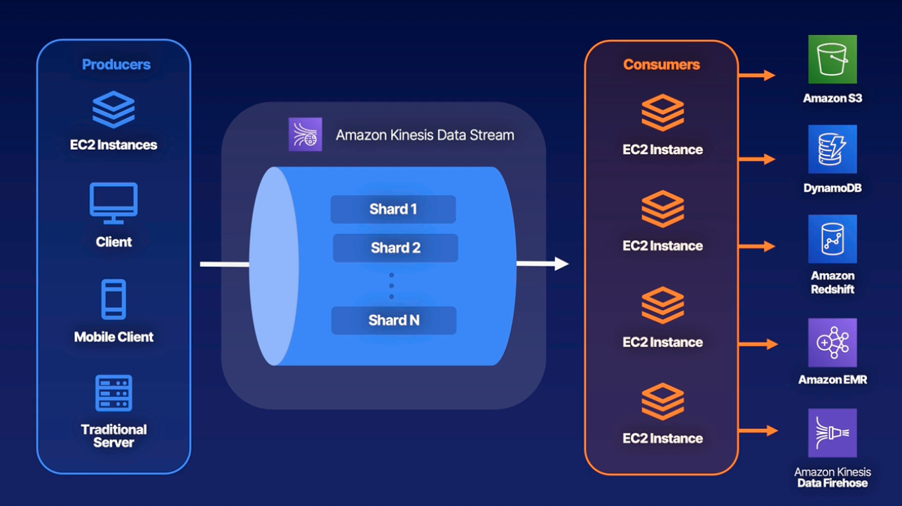
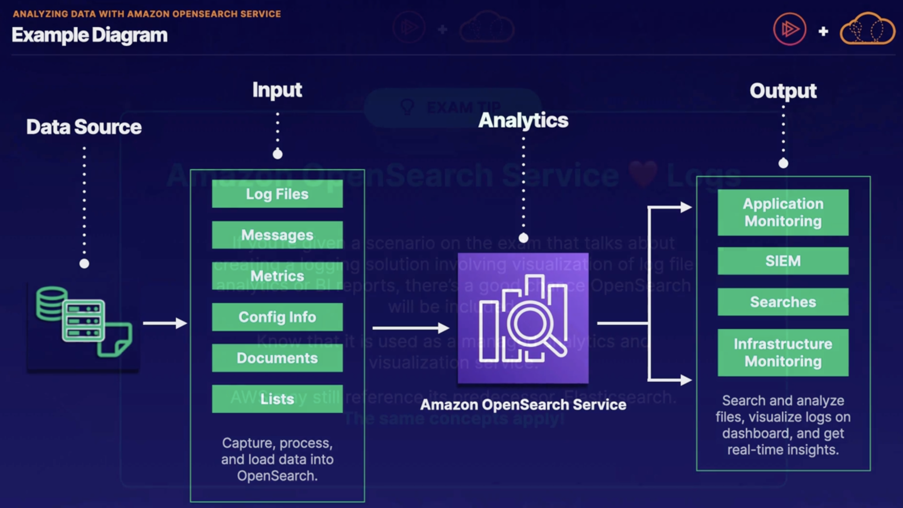

# Big Data
## Exploring Large Redshift Databases

### Three Vs of Big Data

**Volume**
Ranges from terabytes to petabytes

**Variety**
Includes data from a wide range of sources and formats.

**Velocity**
Data needs to be collected, stored, processed, and analyzed within a short period of time.

### What is Redshift

Redshift is a fully managed, petabyte-scale data warehouse service in the cloud.

It's a very large relational database traditionally used in big data applications.

Fun fact: Received it's name due to the desire to have people leave Oracle databases and leverage this AWS service instead.

### Redshift Overview and Uses

**Size**
Redshift is incredibly big -- it can hold up to 16 PB of data.  You don't have to split up your large datasets!

**Relational**
This database is relational.  You use your standard SQL and business intelligence (BI) tools to interact with it.

**Based on PostgreSQL**
This is based on the PostgreSQL database engine type; however it is NOT used for OLTP workloads.

**Usage**
Redshift is not meant to be a replacement for standard RDS databases

**High Performance**
Offers up to 10x the performance of other data warehouses offered in the cloud.

**Columnar**
Storage of data is column-based instead of row based.  Allows for efficient parallel queries.

### High Availability, Snapshot, and Disaster Recovery

- Redshift now supports Multi-AZ deployments!  It only spans two AZs at this time.
- Snapshots are incremental point-in-time. They can be automated or manual.  Always contained in Amazon S3 (you cannot manage the bucket).
- No conversions from single AZ to Multi-AZ (or vice versa)!

**Always Favor Large Batches**
Scenarios on the exam that are needing to optimize Redshift insert performance should favor large data inserts!  Leverage large batch inserts whenever you can.

### Redshift Spectrum and Enhanced VPC Routing

**Redshift Spectrum**
Efficiently query and retrieve data from Amazon S3 without having to load the data into Amazon Redshift tables

Massive parallelism allows this to run very fast against large datasets.  Uses Redshift servers that are independent of your cluster!

**Enhanced VPC Routing**
All COPY and UNLOAD traffic between your cluster and your data repositories is forced through your VPC

Enables you to use VPC features like VPC Endpoints, VPC Flow Logs, etc.

---
## Elastic MapReduce (EMR)

### What is ETL

Extract Transform and Load

### What is EMR

An AWS service to help with ETL processing.
EMR is a managed big data platform that allows you to process vast amounts of data using open-source tools, such as Spark, Hive, HBase, Flink, Hudi, and Presto.

### EMR Storage

There are three different types of storage options within Amazon EMR

**Hadoop Distributed File System (HDFS)**
Distributed, scalable file system for Hadoop that distributes stored data across instances.  Used for caching results during processing.

**EMR File System (EMRFS)**
Extends Hadoop to add the ability to directly access data stored in Amazon S3 as if it were a part of HDFS.  S3 is typically used to store input and output data, not intermediate data.

**Local file system**
Locally connected disk created with each EC2 instance.  Instance store volumed only remain during the lifecycle of the Amazon EC2 instance.

### Amazon EMR Clusters and Nodes

Clusters are groups of EC2 instances within Amazon EMR.  Each instance is a node.

**Primary Node**
Manages the cluster, coordinates distribution of data and tasks, tracks health statuses.

**Core Node**
Runs tasks and stores data in Hadoop Distributed File System (HDFS).  Long running!

**Task Node**
ONLY runs tasks, with no storage of data within HDFS.  Optional.  Typically Spot instances.

### Purchasing Options and Cluster Types

**1 - On Demand**
Most reliable purchase option.  Will not be terminated.  Most expensive choice.

**2 - Reserved**
Just like other reserved instances.  Minimum of 1 year.   Offers great cost savings.  Typically used for primary nodes and core nodes.

**3 - Spot**
Cheapest option available.  Can be terminated with little warning.  Typically used for task nodes.

**4 - Long-Running or Temporary**
Clusters can either be long-running, or they can be transient (a.k.a. temporary).

### EMR Architecture

---
## Streaming Data with Kinesis

### What is Kinesis

Kinesis allows you to ingest, process and analyze real-time streaming data.  You can think of it as a huge data highway connected to your AWS account.

There are 2 major types of Kinesis you need to be familiar with

|  | Data Streams | Data Firehose |
| ---- | ---- | ---- |
| **Purpose** | Real-time streaming for ingesting data | Data transfer tool to get information to S3, Redshift, Elasticsearch, or Splunk |
| **Speed** | Real time | Near real time (within 60 seconds) |
| **Difficulty** | You're responsible for creating the consumer and scaling the stream | Plug and play with AWS architecture |

### Kinesis Data Streams

### Kinesis Data Firehose

### Kinesis Data Analytics and SQL

Analyze data using standard SQL

**Easy**
It's very simple to tie Data Analytics into your Kinesis pipeline.  It's directly supported by Data Firehose and Data Streams.

**No Servers**
This is a fully managed, real-time serverless service.  It will automatically handle scaling and provisioning of needed resources.

**Cost**
You only pay for the amount of resources you consume as your data passes through.

### Kinesis vs SQS

When we're looking for a message broker, which do we pick?

**SQS**
SQS is a messaging broker that is simple to use and doesn't require much configuration.  It doesn't offer real-time delivery.

**Kinesis**
Kinesis is a bit more complicated to configure and is mostly used in big data applications.  It does provide real-time communication.

---
## Amazon Athena and AWS Glue

### Amazon Athena

Athena is an interactive query service that makes it easy to analyze data in S3 using SQL.  This allows you to directly query data in your S3 bucket without loading it into a database.

### Amazon Glue

Glue is a serverless data integration service that makes it easy to discover, prepare, and combine data.  It allows you to perform ETL workloads without managing underlying servers.

### Using Them Together

1. Unstructured data from different sources is stored in S3
2. Point Glue at the data.  Glue builds a catalog (structure) around the data
3. Redshift Spectrum allows you to use Redshift without having to load data in Redshift database
4. Alternatively use Athena to run queries on the data in the Glue Catalog.
5. Amazon Quicksight to visualize (dashboard) around those queries.

--- 
## Amazon QuickSight

Fully managed, serverless business intelligence (BI) data visualization service.

It allows you to easily create dashboards and share them with specific users and groups.

### Features and Use Cases

- Useful for business data visualizations, ad-hoc data analytics, and obtaining important data-based business insights.
- Integrates with Amazon RDS, Amazon aurora, Athena, S3, and many more!
- SPICE: Robust in-memory engine used to perform advanced calculations (**S**uperfast **P**arallel **I**n-memory **C**alculation **E**ngine)
- Enterprise offering lets you implement Column Level Security (CLS)
- Pricing is on a per-session and per user basis.

### Dashboards, Users, and Groups

- Users can be created for accessing QuickSight
- Enterprise version allows you to also create groups
- Users and groups only exists in QuickSight (not IAM)
- Dashboards allow for stored configuration and filtering
- You can share dashboards and analysis results with users and groups. 
	- Shared dashboard users can see the underlying data!!

---
## AWS Data Pipeline

AWS Data Pipeline is a managed Extract, Transform, Load (ETL) service for automating movement and transformation of your data.

### AWS DataPipeline Overview

**Data Driven**
Define dat-driven workflows.  Steps are dependent on previous tasks completing successfully.

**Parameters**
Define your parameter for data transformations.  AWS Data  Pipeline enforces your chosen logic.

**Highly Available**
AWS hosts the infrastructure on highly available and distributed infrastructure.  Also fault tolerant!

**Handling Failures**
Automatically retries failed activities.  Configure notifications via Amazon SNS for failures or even successful tasks.

**AWS Storage Services**
Integrates easily with Amazon DynamoDB, Amazon RDS, Amazon Redshift, and Amazon S3.

**AWS Compute**
Works with Amazon EC2 and Amazon EMR for compute needs.

### Components

**Pipeline Definition**
Specify the business logic of your data management needs

**Managed Compute**
Service will create EC2 instances to perform your activities -- or leverage existing EC2

**Task Runners**
Task runners (EC2) poll for different tasks and perform them when found.

**Data Nodes**
Define the locations and types of data that will be input and output.

**Activities** are pipeline components that define the work to perform

### Popular Use Cases

1. Processing data in EMR using Hadoop Streaming
2. Importing or exporting DynamoDB data
3. Copying CSV files or data between S3 buckets
4. Exporting RDS data to S3
5. Copying data to Redshift

### Example Diagram

---
## Amazon Managed Streaming for Apache Kafka (MSK)

### Amazon MSK Overview

**Apache Kafka**
Fully managed service for running data streaming applications that leverage Apache Kafka

**Control Plane**
Provides control-plane operations.  Creates, updates, and deletes clusters as required.

**Data Plane**
Leverage Kafka data-plane operations for producing and consuming streaming data.

**Existing Applications**
Open-source versions of Apache Kafka allow support for existing apps, tools, and plugins.

### Important Components and Concepts

**Broker Nodes**
Specify the amount of broker nodes per AZ you want at time of cluster creation.

**Zookeeper Nodes**
Zookeeper nodes are created for you

**Flexible Cluster Operations**
Perform cluster operations with the console, AWS CLI, or APIs within any SDK.

**Producers, Consumers, and Topics**
Kafka data-plane operations allow creation of topics and ability to produce/consume data.

### Resiliency in Amazon MSK

**Automatic Recovery**
Automatic detection and recovery from common failure scenarios.  Minimal impact!

**Detection**
Detected broker failures result in mitigation or replacement of unhealthy nodes.

**Reduce Data**
Tries to reuse storage from older brokers during failures to reduce data needing replication.

**Time Required**
Impact time is limited to however long it takes Amazon MSK to complete detection and recovery.

**After Recovery**
After successful recovery, producers and consumer apps continue to communicate with the same broker IP as before.

### Good to Know

**MSK Serverless**
Cluster type within Amazon MSK offering serverless cluster management.  Automatic provisioning and scaling.

**Fully Compatible**
MSK Serverless is fully compatible with Apache Kafka.  Use the same client apps for producing and consuming data.

**MSK Connect**
Allows developers to easily stream data to and from Apache Kafka clusters.

### Security and Logging

- Integration with Amazon KMS for SSE requirements
- Encryption at rest by default
- TLS 1.2 for encryption in transit between brokers in clusters
- Deliver broker logs to Amazon CloudWatch, Amazon S3, and Amazon Kinesis Data Firehose
- Metrics are gathered and sent to CloudWatch
- All Amazon MSK API calls are logged to AWS CloudTrail

---
## Analyzing Data with Amazon OpenSearch Service

### What is OpenSearch?

OpenSearch is a manages service allowing you to run search and analytics engines for various use cases.

It is the successor to Amazon Elasticsearch Service

### Service Features

- **Quick Analysis**
	  Quickly ingest, search, and analyze data in your clusters.  Commonly part of an ETL process.
- **Scalable**
	  Easily scalable cluster infrastructure running the open-source OpenSearch services.
- **Security**
	  Leverage IAM for access control, VPC security groups, encryption at rest and in transit, and field-level security.
- **Stability**
	  Multi-AZ-capable service with master nodes and automated snapshots.
- **Flexible**
	  It allows for SQL support for business intelligence (BI) apps.
- **Integrations**
	  Easily integrate it with Amazon CloudWatch, AWS CloudTrail, Amazon S3, and Amazon Kinesis.

### Example Diagram

### Exam Tip

**Amazon OpenSearch Service ❤️ Logs**

If you're given a scenario on the exam that talks about creating a logging solution involving visualization of log file analytics or BI reports, there's a good chance OpenSearch will be included.

Know that it is used as a managed analytics and visualization service.

AWS may still reference its predecessor, Elasticsearch.  The same concepts apply!

---
