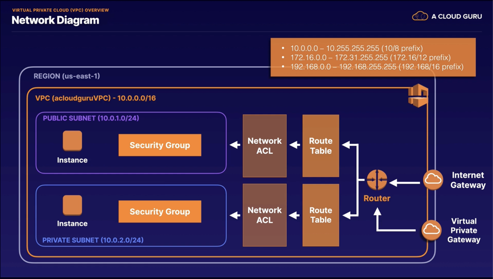
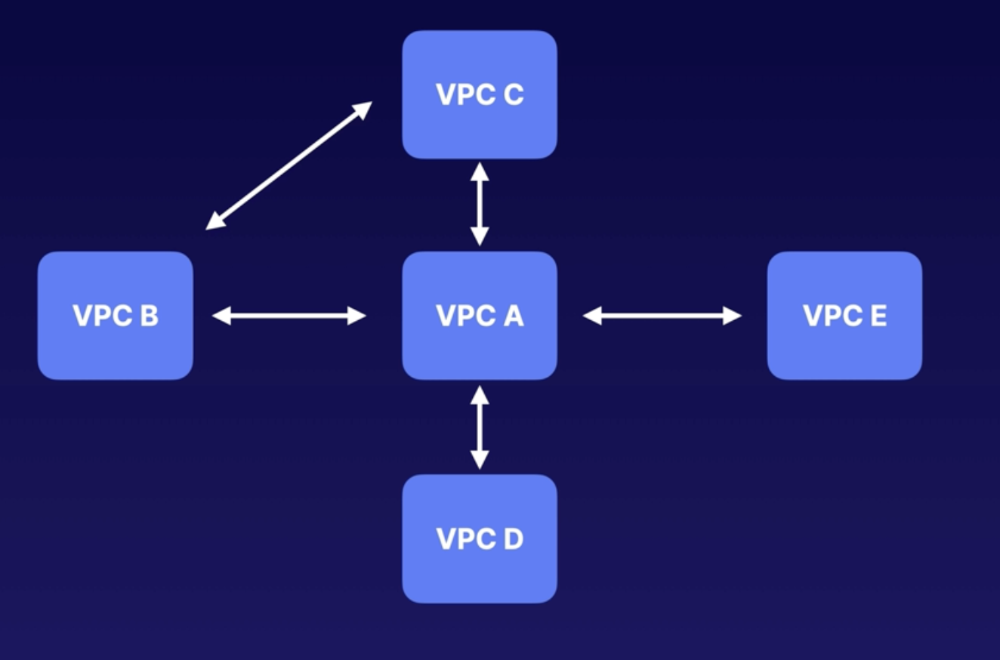
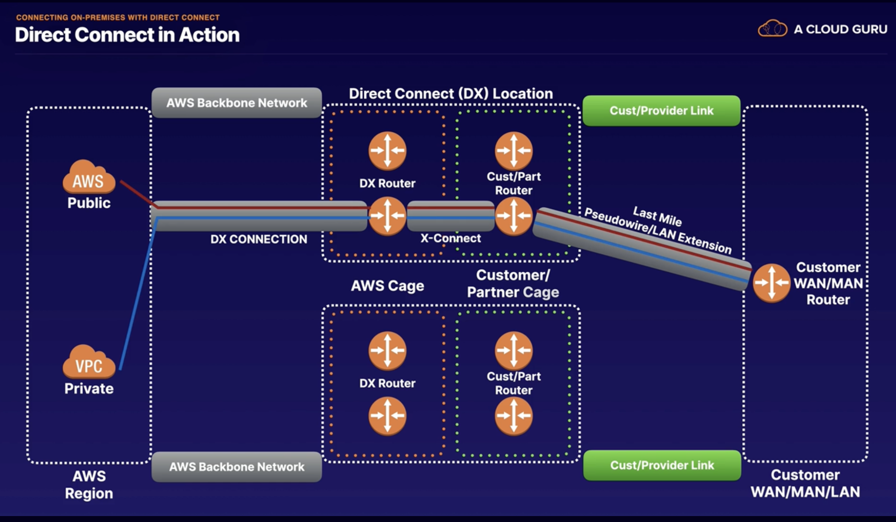
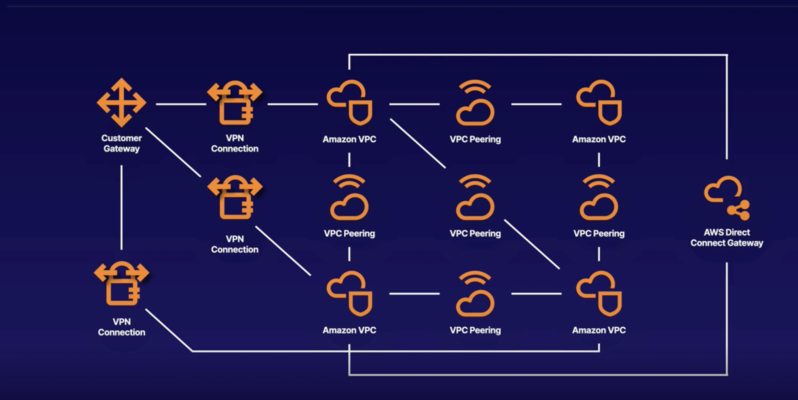
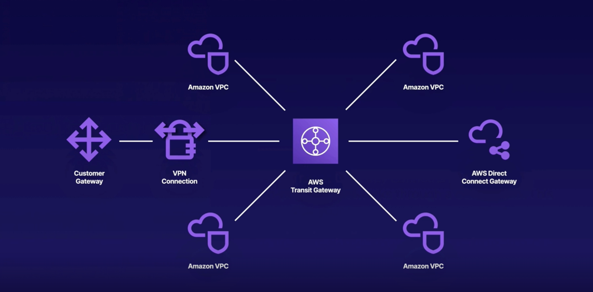

# Virtual Private Clound (VPC) Networking
## VPC Overview

### What is a VPC?

Think of a VPC as a virtual data center in the cloud.

- Logically isolated part of the AWS Cloud where you can define your own network.
- Complete control of virtual network, including your own IP address range, subnets, route tables, and network gateways.

### Networking

**Fully Customizable Network**
You can leverage multiple layers of security, including security groups and network access control lists, to help control access to Amazon EC2 instances in each subnet.

- **Web** - Public-facing subnet
- **Application** - Private subnet.  Can only speak to web tier and database tier.
- **Database** - Private subnet.  Can only speak to the application tier.

### VPNs

Additionally, you can create a **hardware Virtual Private Network (VPN)** connection between your corporate datacenter and your VPC and leverage the AWS Cloud as an extension of your corporate data center.

### Network Diagram

### VPC Features

**Launch Instances**
Launch instances into a subnet of your choosing.

**Custom IP Addresses**
Assign custom IP address ranges in each subnet.

**Route Tables**
Configure route tables between subnets.

**Internet Gateway**
Create an internet gateway and attach it to our VPC

**More Control**
Much better security control over your AWS resources.

**Access Control Lists**
Subnet network access control lists.

*You can use network access control lists (**NACLs**) to block specific IP addresses.*

### Comparing VPCs

#### Default VPC
- Default VPC is user friendly
- All subnets in default VPC have a route out to the internet.
- Each EC2 instance has both a public and a private IP address.

#### Custom VPC
- Fully customizable
- Takes time to set up

### Exam Tips

- Think of a VPC as a logical data center in AWS
- Consists of internet gateways (or virtual private gateways), route tables, network access control lists, subnets, and security groups.
- 1 subnet is always in 1 Availability Zone

---

## Demo - Provisioning a VPC

Three things automatically created when you create a VPC
- Route table
- Network ACL
- Security Group

VPCs can have only **ONE** internet gateway

---
## Using NAT Gateways for Internet Access

### What is a NAT Gateway?

You can use a network address translation (NAT) gateway to to enable instances in a private subnet to connect to the internet or other AWS services while preventing the internet from initiating a connection with those instances.
### Network Diagram

### NAT Gateway Tips

- Redundant inside the Availability Zone
- Starts at 5Gbps and scales currently to 45 Gbps
- No need to patch
- Not associated with security groups
- Automatically assigned a public IP address

---

## Protecting Your Resources with Security Groups

### Connectivity Troubleshooting

- Start with Route tables
- Then check network ACLs
- Then check Security Groups

### Security Groups

Security Groups are **virtual firewalls for an EC2 instance**.  By default, everything is blocked.

To let everything in `0.0.0.0/0`

In order to **communicate to your EC2 instances via SSH, RDP, or HTTP**, you will need to **open up the correct ports.**

### Exam Tip

Security groups are stateful - if you send a request from your instance, the response traffic for that request is allowed to flow in regardless of inbound security group rules.

Responses to allowed inbound traffic are allow to flow out, regardless of outbound rules.

---
## Controlling Subnet Traffic with Network ACLs

### What is a Network ACL?

The first line of defense
- A network access control list (ACL) is an optional layer of security for your VPC that acts as a firewall for controlling traffic in and out of one or more subnets.
- You might set up network ACLs with rules similar to your security groups in order to add another layer of security to your VPC.

### Network ACLs Overview

- **Default Network ACLs**
	  Your VPC automatically comes with a default network ACL, and by default it allows all outbound and inbound traffic.
- **Custom Network ACLs**
	  You can create custom network ACLs. By default, each custom network ACL denies all inbound and outbound traffic until you add rules.
- **Subnet Associations**
	  Each subnet in your VPC must be associated with a network ACL.  If you don't explicitly associate a subnet with a network ACL, the subnet is automatically associated with the default network ACL.
- **Block IP Addresses**
	  Block IP addresses using network ACLs, not security groups.

### Network ACL Tips

- You can associate a network ACL with multiple subnets; however a subnet can be associated with **only 1 network ACL** at a time.  When you associate a network ACL with a subnet, the previous association is **removed.**
- Network ACLs contain a **numbered list of rules** that are evaluated in order, starting with the **lowest** numbered rule.
- Network ACLs have **separate** inbound and outbound rules, and each rule can either **allow or deny traffic**.
- Network ACLs are **stateless**; responses to allowed inbound traffic are subject to the rules for outbound traffic (and vice versa).

---
## Private Communication Using VPC Endpoints

### What are VPC Endpoints?

A VPC endpoint enables you to privately connect to your VPC to supported AWS services and VPC endpoint services powered by PrivateLink without requiring an internet gateway, NAT device, VPN connection, or AWS Direct Connect connection.

Instances in your VPC do not require public IP addresses to communicate with resources in the service.

**Traffic between your VPC and the other service does NOT leave the Amazon Network.**

#### Endpoint are Virtual Devices

They are horizontally scales, redundant, and highly available VPC components that allow communication between instances in your VPC and services without imposing availability risks or bandwidth constraints on your network traffic.
### VPC Endpoint Types

There are 2 types of endpoints.
#### Interface Endpoints
An interface endpoint is an elastic network interface with a private IP address that serves as an entry point for traffic headed to a supported service.  They support a large number of AWS services.

#### Gateway Endpoints
Similar to NAT gateways, a gateway endpoint is a virtual device you provision. It supports a connection to S3 and DynamoDB.

### Exam Tips

- **Use Case:** When you want to connect AWS services without leaving the Amazon internal network
- **2 Types of VPC Endpoints:** Interface endpoints and gateway endpoints
- **Gateway Endpoints:** Support S3 and DynamoDB

---
## Building solutions across VPCs with Peering

### Multiple VPCs
Sometimes you may need to have several VPCs for different environments, and it may be necessary to connect these VPCs to each other.

**Example**
- Production Web VPC
- Content VPC
- Intranet
### VPC Peering
- Allows you to connect 1 VPC to another via a direct network route using private IP addresses
- Instances behave as if they were on the same private network
- You can peer VPCs with other AWS accounts as well as with other VPCs in the same account.
- Peering is in a start configuration (e.g. 1 central VPC peers with 4 others). No transitive peering!
- You can peer between regions.

### Transitive Peering
Transitive peering is not allowed.  A VPC cannot connect to another VPC via a peer.  It must directly peer with a VPC it needs to connect to.

### Exam Tips

- **Allows you to connect** 1 VPC to another via a direct network route using private IP addresses
- **Transitive peering is not supported.**  This must always be in a hub-and-spoke model.
- **You can peer between regions and accounts.**
- **No overlapping CIDR address ranges**

---
## Network Privacy with AWS PrivateLink

### Opening Your Services in a VPC to Another VPC

Two ways to do this.
- Open the service up to the internet
- Use VPC Peering

### Sharing Applications Across VPCs

To open our application up to other VPCs, we can either:

**Open the VPC up to the internet**
- Security considerations; everything in the public subnet is public
- A lot more to manage

**Use VPC Peering**
- You will have to create and manage many different peering relationships.
- The whole network will be accessible.  This isn't good if you have multiple applications within your VPC.

Note: the whole network will be accessible via VPC peering if you explicitly allow all traffic within security groups and NACLs from the peered VPC.

### Using PrivateLink

- The best way to expose a service VPC to tens, hundreds, or thousands of customer VPCs
- Doesn't require VPC peering; no route tables, NAT gateways, internet gateways, etc.
- Requires a Network Load Balancer on the service VPC and an ENI (Elastic Network Interface) on the customer VPC

---
## Securing Your Network with VPN CloudHub

### AWS VPN CloudHub

If you have multiple sites, each with its own VPN connection, you can use AWS VPN CloudHub to connect those sites together

- Hub-and-spoke model
- Low cost and easy to manage
- It operates over the public internet, but all traffic between the customer gateway and the AWS VPN CloudHub is encrypted

---
## Connecting On-Premises with Direct Connect

### Direct Connect

AWS Direct Connect is a cloud service solution that **makes it easy to establish a dedicated network connection** from your premises to AWS

### Private Connectivity

Using AWS Direct Connect you can establish private connectivity between AWS and your data center or office.

**In many cases, you can reduce your network costs, increase bandwidth throughput, and provide a more consistent network experience than internet-based connections.**

### Types of Connections
2 Types of Direct Connect Connection

- **Dedicated Connection:** A physical Ethernet connection associated with a single customer.  Customers can request a dedicated connection through the AWS Direct Connect console, the CLI, or the API.
- **Hosted Connection:** A physical Ethernet connection that an AWS Direct Connect Partner provisions on behalf of a customer.  Customer request a hosted connection by contacting a partner in the AWS Direct Connect Partner Program, who provisions the connection.

### Direct Connect in Action

### VPN vs. Direct Connect

VPNs allow private communication, but it still traverses the public internet to get the data delivered.  While secure, it can be painfully slow.

**Direct Connect is:**
- Fast
- Secure
- Reliable
- Able to take massive throughput

### Exam Tips

- Direct Connect directly connects your data center to AWS
- Useful for high-throughput workloads (e.g. lots of network traffic)
- Helpful when you need a stable and reliable secure connection

---
## Simplifying Networks with Transit Gateway

### Transit Gateway

AWS Transit Gateway connects VPCs and on-premises networks through a central hub.  This simplifies your network and puts and end to complex peering relationships.  It acts as a cloud router -- each new connection is only made once.

### Simplify Network Topology

### Transit Gateway Facts

- Allows you to have transitive peering between thousands of VPCs and on-premise data centers.
- Works on a hub-and-spoke model.
- Works on a regional basis, but you can have it across multiple regions.
- You can use it across multiple AWS accounts using RAM (Resource Access Manager)

### Exam Tips

- You can use route tables to limit how VPCs talk to one another.
- Works with Direct Connect as well as VPN connections.
- Supports IP multicast (not supported by any other AWS service).

---
## 5G Networking with AWS Wavelength

### 5G Networks

5G provides mobile devices with higher speed, lower latency, and greater capacity that 4G LTE networks.  It is one of the fastest, most robust technologies the world has ever seen.

### AWS Wavelength

AWS Wavelength embeds AWS compute and storage services within 5G networks, providing mobile edge computing infrastructure for developing, deploying, and scaling ultra-low-latency applications.

### Exam Tips

**Scenario Question about Mobile Edge Computing**
If you see a scenario question about 5G increasing application speeds at edge using mobile networks...

**Think of AWS Wavelength!**